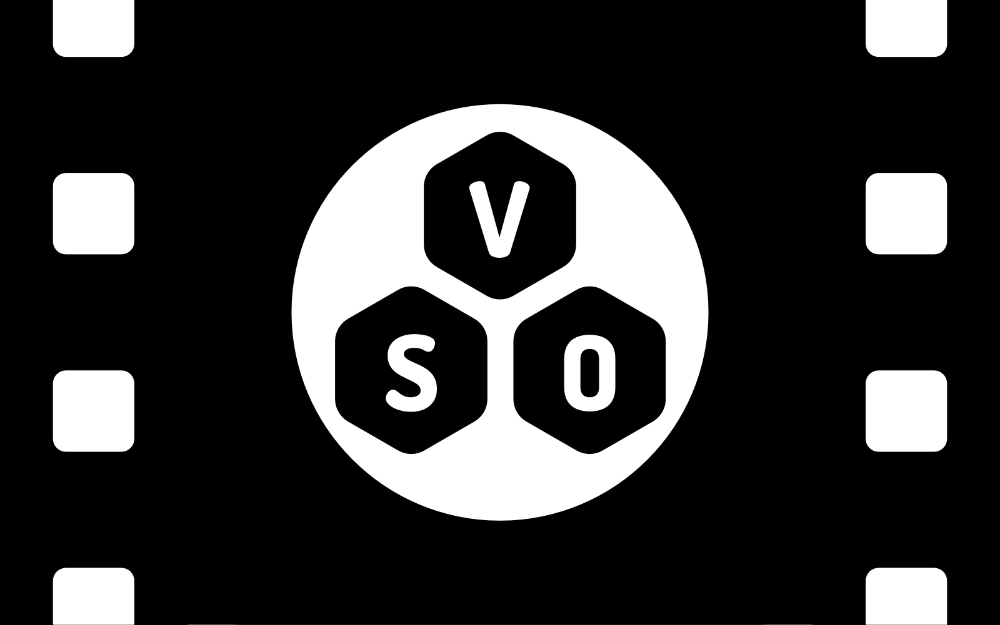

# Veovera Software organization

## Intro

Established in 2022, the Veovera Software Organization (VSO) is a not-for-profit entity with a mission to enhance software for the public good. VSO has been instrumental in advancing the Real-Time Messaging Protocol (RTMP), notably with the inclusion of industry leaders like Adobe, YouTube, and Twitch in our collaborative efforts.

## Abstract

In response to the evolving needs of the media streaming industry, VSO has taken a leading role in modernizing the RTMP/FLV protocol. This technology, foundational to streaming yet largely unchanged for over two decades, has been revitalized through our initiatives. Our key publication, [enhanced-rtmp-v1.pdf](./docs/enhanced/enhanced-rtmp-v1.pdf) | [enhanced-rtmp-v1.md](./docs/enhanced/enhanced-rtmp-v1.md), presents comprehensive enhancements that incorporate advanced video codecs such as VP9, HEVC, and AV1. These improvements align RTMP with the latest in streaming technology standards.

Our ongoing commitment extends beyond these initial enhancements. We are actively working on incorporating popular audio codecs like Opus, FLAC, AC-3, and E-AC-3, alongside developing features such as seamless reconnect commands, multichannel and multitrack. Our approach is to foster innovation while ensuring backward compatibility, enhancing RTMP's utility without disrupting the existing infrastructure.

We continue to value and encourage feedback and collaboration from the wider community. Your insights are vital to our ongoing efforts and can be shared by creating a new issue at <**[new issue](https://github.com/veovera/enhanced-rtmp/issues)**>.
